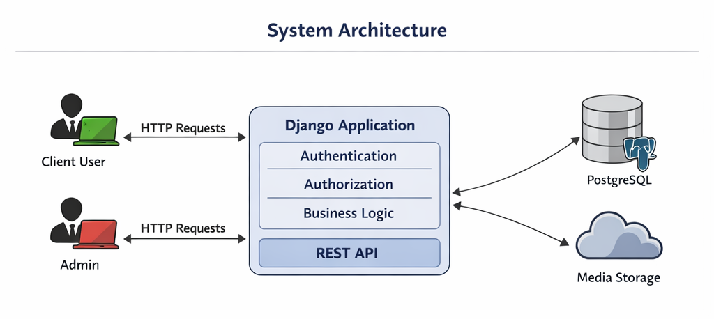
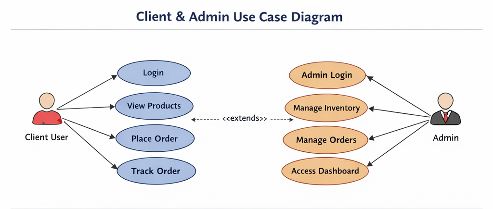
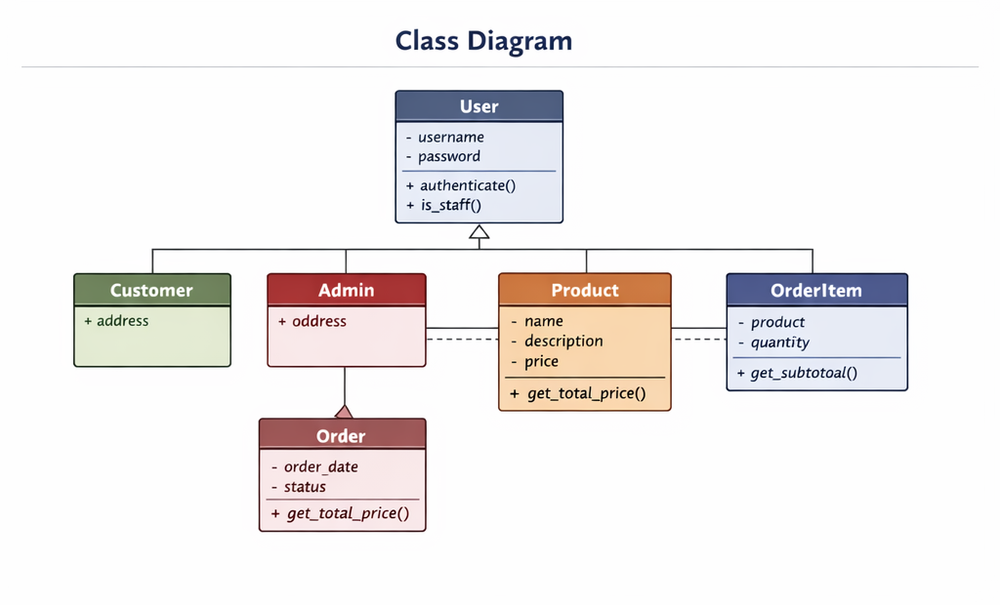

# 🏥 Teryaq-Pharmacy-System

## 📌 Project Overview

A **full-featured Pharmacy Management System** built using **Django**, designed and implemented with a **real-world software engineering mindset**. This project simulates an actual pharmacy workflow, focusing on scalability, clean architecture, and clear separation of concerns.

This is **not a tutorial project** — it is a practical system suitable for portfolios, academic submission, and real deployment after minor extensions.

---

## 🎯 Project Goals

- Build a real e-commerce–like pharmacy system
- Apply Django Authentication & Authorization correctly
- Practice clean backend architecture
- Deliver a responsive and user-friendly UI
- Create a solid base for future expansion

---

## 👥 User Roles

### 👤 Client (User)

- Register / Login
- Browse medicines by category
- View medicine details
- Add medicines to cart
- Update quantities in cart
- Place orders

### 🛠️ Admin (Dashboard)

- Secure admin dashboard
- Manage categories (CRUD)
- Manage medicines (CRUD + images)
- View and manage orders
- Restricted access using authorization

---

## 🔐 Authentication & Authorization

| Concept        | Implementation                          |
| -------------- | --------------------------------------- |
| Authentication | Django Built-in Auth (Login / Register) |
| Authorization  | `login_required`, staff checks          |
| Cart Security  | Django Sessions                         |

Only authorized users can access sensitive pages such as the dashboard.

---

## 🛒 Cart System (Session-Based)

- Cart stored using Django sessions
- Each item stored as: `{medicine_id: quantity}`
- Supports:
  - Add to cart
  - Increase / decrease quantity
  - Remove item

Efficient, simple, and scalable for small to medium systems.

---

## 📦 Orders System

- Each Order belongs to one User
- Each Order contains multiple OrderItems
- Total price calculated dynamically
- Easily extendable to payment gateways

---

## 🏗️ System Architecture



```
Client (Browser)
     ↓ HTTP Requests
Django Views (Controller Logic)
     ↓
Django Models (Business Logic)
     ↓
Database (SQLite → PostgreSQL Ready)
```

This architecture follows Django MVT with clear separation between presentation, logic, and data layers.

---

## 📐 UML Diagrams

### Client & Admin Use Case Diagram



### Class Diagram



---

## 📐 UML – Use Case Diagram (Textual)

### Client Use Cases

- Register / Login
- Browse Medicines
- Manage Cart
- Place Order

### Admin Use Cases

- Login
- Manage Medicines
- Manage Categories
- View Orders

---

## 🧩 UML – Class Diagram (Core Models)

- **Category**

  - name
  - image

- **Medicine**

  - name
  - price
  - image
  - category

- **Order**

  - user
  - created_at
  - total_price

- **OrderItem**
  - order
  - medicine
  - quantity

---

## 🧪 Engineering Principles Applied

- Separation of Concerns
- Reusability
- Clean URLs
- Secure Access Control
- Scalable Structure

---

## 🧰 Tech Stack

- **Backend:** Django (Python)
- **Frontend:** HTML, Tailwind CSS
- **Database:** SQLite (development)
- **Auth:** Django Authentication System
- **Version Control:** Git & GitHub

---

## 📂 Project Structure

```
Teryaq-Pharmacy-System/
│
├── TeryaqPharma/              # Django Project Settings
│
├── store/                     # Main Application
│   ├── migrations/
│   ├── static/store/          # Static files (CSS, JS, Images)
│   ├── templates/store/       # HTML Templates
│   ├── admin.py
│   ├── apps.py
│   ├── forms.py
│   ├── models.py              # Category, Medicine, Order, OrderItem
│   ├── tests.py
│   ├── urls.py
│   └── views.py
│
├── media/                     # Uploaded media files
│   ├── category_images/
│   ├── medicines/
│   └── image/
│
├── db.sqlite3                 # Development database
├── manage.py
├── README.md
├── requirements.txt
└── venv/
```

---

## 🎓 Academic Value

This project demonstrates:

- Practical backend development
- Correct use of MVC/MVT concepts
- Secure web application design
- Database relationships

Suitable for:

- Faculty submission
- Software Engineering courses
- Django practical exams

---

## 🚀 Future Enhancements

- Online Payment Integration
- Order Status Tracking
- REST API (DRF)
- Mobile App Support
- Advanced User Profiles

---

## 👨‍💻 Developer Statement

> This project reflects my mindset as a Computer Engineering student who believes that **real learning happens when software solves real problems**. Every feature was implemented intentionally — not copied — and designed to be clean, scalable, and production-ready.

---

## 👨‍💻 Developer

**Mohamed Ayman**  
Computer Engineering – Systems & Computers  
Focused on building scalable, real-world systems using Django and modern web technologies.

---

## ✅ Final Notes

This system is not the end — it is a **strong foundation**.

Built to grow. Built to matter.
